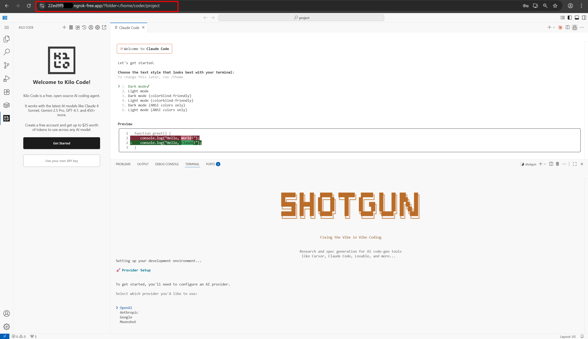
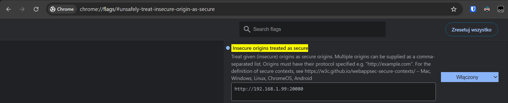

# VS Code Environment (VSCE)

A Docker-based VS Code Environment running code-server. Get a consistent, portable VS Code experience with customizable extensions and system packages.

[](https://github.com/nchekwa/vsce/tags)
[](https://github.com/nchekwa/vsce/actions/workflows/docker-publish.yml)
[](https://opensource.org/licenses/MIT)



## Quick Start

```bash
git clone https://github.com/nchekwa/vsce.git
cd vsce
docker-compose up -d
```

Access VS Code at `http://localhost:20080` with password `vsce`.

## Features

- **VS Code in Browser**: Full VS Code experience via code-server
- **Automatic Extension Management**: Pre-installed extensions on container start
- **System Package Installation**: Install additional Debian packages
- **Global NPM Package Management**: Install npm packages globally across the container
- **Multi-Language Support**: Pre-configured Node.js and Python environments
- **Multi-line Configuration**: Support for YAML-style multi-line configuration in docker-compose
- **Directory Auto-Creation**: Automatic creation of required directories for persistent storage
- **Persistent Configuration**: Settings, extensions, and data persist across restarts
- **Security Scanning**: Automated vulnerability scanning with Trivy and Snyk

## Configuration

### Docker Compose Example

```yaml
services:
  vsce:
    container_name: vsce
    hostname: vsce
    image: ghcr.io/nchekwa/vsce:latest
    ports:
      - 20080:20080     # HTTP to Code-Server
      - 20443:20443     # HTTPS to Caddy->Code-Server[HTTP]
      - 20022:20022     # SSH (if env SSHD_ENABLED=true)
    volumes:
      - ./project/:/home/coder/project             # Project files -> mounted as /home/coder/project
      - ./data/config/:/home/coder/.config              # User config files
      - ./data/code/:/home/coder/.code                  # User files related to code-server
      - ./data/local/:/home/coder/.local                # User local files
      - /var/run/docker.sock:/var/run/docker.sock       # If you need to access from inside docker to host docker instance
    #user: "${UID}:${GID}"
    environment:
      DOCKER_USER: $USER
      PASSWORD: ${PASSWORD:-vsce}
      INSTALL_EXTENSIONS_FORCE: ${INSTALL_EXTENSIONS_FORCE:-false}
      INSTALL_EXTENSIONS: |
        ms-python.python
        ms-python.flake8
        ms-python.pylint
        ms-pyright.pyright
        redhat.vscode-yaml
        ms-azuretools.vscode-docker
        ms-azuretools.vscode-containers
        kilocode.kilo-code
        anthropic.claude-code
      INSTALL_DPKG: |
        git
        docker.io
      INSTALL_NPM: |
        @anthropic-ai/claude-code
        @proofs-io/shotgun
        @proofs-io/shotgun-server
      CADDY_ENABLED: "${CADDY_ENABLED:-false}"
      SSHD_ENABLED: "${SSHD_ENABLED:-false}"
      NGROK_AUTHTOKEN: "${NGROK_AUTHTOKEN:-}"
    stdin_open: true
```

> **Warning**: Some extensions such as KiloCode, Roo Code, and Cline may not work with VSCE unless accessed over an SSL proxy with a valid certificate. This issue is due to the Chrome browser blocking web views.
>
> If using Chrome, you can circumvent this by marking web views as secure:
>
> 1. Open Chrome and navigate to:
>
>    ```
>    chrome://flags/#unsafely-treat-insecure-origin-as-secure
>    ```
>
> 2. Add your VSCE URL to the list of insecure origins, e.g., `http://192.168.1.100:20080`.
>
> Please note, this workaround is applicable only for HTTP connections. For HTTPS/SSL connections, ensure you use a valid certificate for VSCE to function correctly. Use nGrok for testing SSL - you will find in `project` folder **vsce_ngrok.txt** file with URL.



### Environment Variables

| Variable | Description | Default |
|----------|-------------|---------|
| `PASSWORD` | VS Code password | `vsce` |
| `INSTALL_EXTENSIONS` | VS Code extensions (supports multi-line YAML) | `""` |
| `INSTALL_DPKG` | System packages to install via apt | `""` |
| `INSTALL_NPM` | Global npm packages to install | `""` |
| `EXTENSIONS_UPDATE` | Update existing extensions | `false` |
| `INSTALL_EXTENSIONS_FORCE` | Force reinstall extensions | `false` |
| `BOOT_INSTALL_SCRIPT` | Custom boot script path | `""` |
| `CADDY_ENABLED` | Enable Caddy reverse proxy | `false` |
| `SSHD_ENABLED` | Enable SSH server | `false` |
| `NGROK_AUTHTOKEN` | Ngrok authentication token | `""` |

## Installing Extras in Docker

VSCE supports the automatic installation of additional components during container startup. This section covers how to install extras under different categories and configuration methods.

### Autoinstall Categories

#### VSCE Extensions

VSCE allows you to pre-install VS Code extensions to have them ready when the container starts.

- **Via Configuration File**: Create `/config/extensions.txt` with a list of extension IDs.

  ```
  ms-python.python
  redhat.vscode-yaml
  ms-azuretools.vscode-docker
  ```

- **Via Docker-Compose**: Use the `INSTALL_EXTENSIONS` environment variable in your `docker-compose.yaml`.

  ```yaml
  environment:
    INSTALL_EXTENSIONS: |
      ms-python.python
      redhat.vscode-yaml
      ms-azuretools.vscode-docker
  ```

- **Via Environment Variable**: Set `INSTALL_EXTENSIONS` when running the Docker command.

  ```bash
  docker run -e INSTALL_EXTENSIONS="ms-python.python redhat.vscode-yaml" ghcr.io/nchekwa/vsce:latest
  ```

#### Debian Packages

Install additional system packages via `apt` to customize your environment.

- **Via Configuration File**: Create `/config/dpkg.txt` with a list of packages.

  ```
  git
  curl
  wget
  ```

- **Via Docker-Compose**: Use the `INSTALL_DPKG` environment variable in your `docker-compose.yaml`.

  ```yaml
  environment:
    INSTALL_DPKG: |
      git
      curl
      wget
  ```

- **Via Environment Variable**: Set `INSTALL_DPKG` when running the Docker command.

  ```bash
  docker run -e INSTALL_DPKG="git curl" ghcr.io/nchekwa/vsce:latest
  ```

#### NPM Packages

Install global npm packages to support development workflows.

- **Via Configuration File**: Create `/config/npm.txt` with a list of packages.

  ```
  typescript
  nodemon
  eslint
  ```

- **Via Docker-Compose**: Use the `INSTALL_NPM` environment variable in your `docker-compose.yaml`.

  ```yaml
  environment:
    INSTALL_NPM: |
      typescript
      nodemon
      eslint
  ```

- **Via Environment Variable**: Set `INSTALL_NPM` when running the Docker command.

  ```bash
  docker run -e INSTALL_NPM="typescript nodemon" ghcr.io/nchekwa/vsce:latest
  ```

### Notes on Configuration

- Multi-line YAML format is supported for better readability in `docker-compose.yaml` files.
- When npm packages are specified, VSCE automatically checks for npm availability and installs Node.js if necessary using `nvm.sh`.

## Multi-line Configuration Support

The environment variables support multi-line YAML format for better readability in docker-compose files:

### Multi-line Extensions

```yaml
environment:
  INSTALL_EXTENSIONS: |
    ms-python.flake8
    ms-python.pylint
    redhat.vscode-yaml
    ms-python.python
    ms-azuretools.vscode-docker
    kilocode.kilo-code
```

### Multi-line System Packages

```yaml
environment:
  INSTALL_DPKG: |
    curl
    git
    jq
    htop
    tree
```

### Multi-line NPM Packages

```yaml
environment:
  INSTALL_NPM: |
    @anthropic-ai/claude-code
    typescript
    nodemon
    eslint
    prettier
```

## Global NPM Package Management

VSCE supports automatic installation of global npm packages during container startup:

### Using Environment Variables

```bash
# Set via docker-compose
environment:
  INSTALL_NPM: "typescript nodemon eslint prettier"

# Or set via command line
docker run -e INSTALL_NPM="typescript nodemon" ghcr.io/nchekwa/vsce:latest
```

### Using Configuration Files

Create `/config/npm.txt`:

```
# Global npm packages to install
@anthropic-ai/claude-code
typescript
nodemon
eslint
prettier
@vue/cli
create-react-app
```

### Automatic Node.js Setup

When npm packages are specified, VSCE automatically:

1. Checks if npm is available
2. If not available, installs Node.js using nvm.sh
3. Installs the specified packages globally

## Directory Auto-Creation

VSCE automatically creates required directories for persistent storage:

- `/home/coder/.code/data` - User data and settings
- `/home/coder/.code/extensions` - VS Code extensions

This ensures that:

- Extensions persist across container restarts
- User settings are maintained
- No startup errors from missing directories
- Seamless persistent storage experience

## Base Code-Server vs. OpenVSCode-Server

There are two projects that emulate Visual Studio Code in the browser:

- [OpenVSCode-Server](https://github.com/gitpod-io/openvscode-server/)
- [code-server](https://github.com/coder/code-server)

### What's the difference?

Both code-server and OpenVSCode-Server allow you to access VS Code via a browser. However, they differ in how they integrate VS Code:

- **OpenVSCode-Server**: A direct fork of VS Code with changes committed directly.
- **code-server**: Incorporates VS Code as a submodule and applies changes via patch files.

## CI/CD

Automated workflows handle:

- **Version Management**: Automatic semantic versioning based on commit messages
- **Multi-Platform Builds**: Linux AMD64 and ARM64 support
- **Security Scanning**: Trivy, Snyk, and Dockle integration
- **Docker Publishing**: Automated image publishing to GitHub Container Registry

See [GitHub Actions](https://github.com/nchekwa/vsce/actions) for details.

## License

MIT License - see [LICENSE](LICENSE) file.
